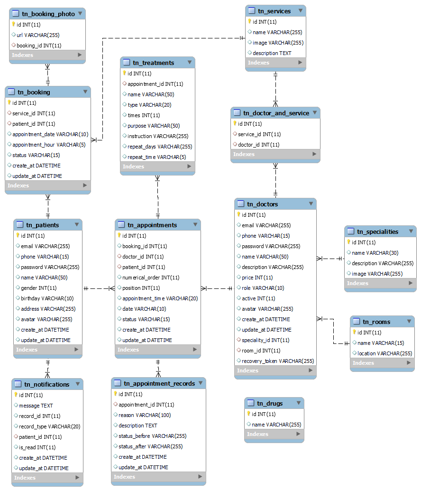

<h1 align="center">Đồ án tốt nghiệp - Học viện Công nghệ Bưu chính viễn thông 
    Ứng dụng Website hỗ trợ bác sĩ quản lý danh sách khám bệnh
</h1>

    

# [**Table Of Content**](#table-of-content)
- [**Table Of Content**](#table-of-content)
- [**Introduction**](#introduction)
- [**Topic**](#topic)
- [**Database**](#database)
- [**Feature**](#feature)
  - [**1. Login**](#1-login)
- [Made with 💘 and PHP ](#made-with--and-php-)

# [**Introduction**](#introduction)

Chào các bạn, mình tên là Nguyễn Thành Phong. 
Mã số N18DCCN147. 
Niên khóa 2018-2023. 

Lời đầu tiên mình xin chào các bạn và cảm ơn tất cả các bạn đang ở đây. Trong tài liệu này mình sẽ chia sẻ tất cả những gì các bạn cần biết khi làm đồ án 
tốt nghiệp và đề tài do mình thực hiện để các bạn có thể tham khảo. Mình hi vọng phần tài liệu mình viết tiếp theo đây 
sẽ hỗ trợ phần nào cho các bạn khi bước tới ngưỡng cửa quan trọng của cuộc đời mình - tốt nghiệp đại học.

Đồ án tốt nghiệp này có tất cả là 3 thành phần bao gồm:

* [**API**](https://github.com/Phong-Kaster/PTIT-Do-An-Tot-Nghiep)

* [**Website**](#) (Hiện tại)
  
* [**Ứng dụng Android**](https://github.com/Phong-Kaster/PTIT-Do-An-Tot-Nghiep-Android)

Dự án các bạn đang đọc là phần ứng dụng website dành cho phía bác sĩ. Website này được bác sĩ sử dụng để tạo lượt khám, cập nhật danh 
sách khám bệnh, viết bệnh án cho bệnh nhân. Website này có vai trò như trang admin 
nếu đem so sánh với các website khác như website bán hàng, website đọc báo,....
 
Nếu bạn chưa đọc các repo còn lại thì trước khi bay vào xem website này có chức năng gì ?? Chúng mình 
hãy cùng nhau tìm hiểu sơ lược đề tài mà Phong đang giải quyết nha 😋😋😋😋

# [**Topic**](#topic)

    

Có thể giải thích yêu cầu đề tài ngắn gọn như sau:

**Website** - Đóng vai trò là ứng dụng quản trị viên. Hỗ trợ bệnh viện quản lý thông tin bác sĩ & bệnh nhân,
sắp xếp lịch khám bệnh giữa bác sĩ và bệnh nhân.

**Android** - Ứng dụng để bệnh nhân đặt lịch khám bệnh, theo dõi phác đồ điều trị và bệnh án của mình. Có thể đặt lịch khám bệnh
cho người thân trong gia đình như ông, bà, bố, mẹ & không nhất thiết người khám bệnh phải là bản thân mình.

Chúng ta sẽ cân phân tích đề tài kĩ hơn vì rất dễ gây nhầm lẫn. Cụ thể chính thầy hướng dẫn và thầy giáo 
phản biện đồ án của mình đã nghĩ thành 2 hướng khác nhau:

**Thầy Nguyễn Anh Hào - giáo viên hướng dẫn**: ứng dụng chỉ để bệnh nhân cung cấp thông tin cá nhân & rút ngắn thời gian khám bệnh. 
Vẫn có chức năng đặt lịch hẹn khám nhưng chỉ để cung cấp thông tin cá nhân, nhằm rút ngắn thời gian khám của bác sĩ. Hoạt động trên 
nguyên tắc `ai đến trước thì được khám trước`, không chấp nhận việc đặt giờ trả tiền trước để vào khám. Điều này ưu tiên 
những bệnh nhân nghèo, không thông thạo các thao tác trên di động, ưu tiên những người đã bỏ thời gian ra xếp hàng để khám bệnh.

**Thầy Huỳnh Trung Trụ - giáo viên phản biện**: ứng dụng là đặt lịch hẹn với bác sĩ. Tức cho chọn chuyên khoa, chọn bác sĩ khám bệnh trước & dĩ nhiên 
là chọn giờ khám luôn. Hoạt động trên nguyên tắc `tôi đặt lịch hẹn thì đúng giờ đó tui phải được vào khám`.

Như trên thì lý luận của 2 thầy đều đúng và Phong thì thiết kế chương trình theo giáo viên hướng dẫn của mình.👼👼👼

Giải thích vậy là cũng khá dễ hiểu rồi. Giờ chúng ta sẽ tiếp tục xem qua sơ bộ cơ sở dữ liệu nhé.

# [**Database**](#database)

    

<h3 align="center">

***Sơ đồ cơ sở dữ liệu***
</h3>

Tớ sẽ giải thích qua về ý nghĩa các bảng xuất hiện trong database nha

**BẢNG PATIENTS** - bảng này chứa thông tin của bệnh nhân.

**BẢNG BOOKING** - bảng này chứa các lịch hẹn mà bệnh nhân đăng ký khám bệnh.

**BẢNG APPOINTMENTS** - bảng này chứa thứ tự lượt khám thực tế của trong ngày của các bác sĩ

**BẢNG TREATMENTS** - bảng này chứa phác đồ điều trị sau khi đã khám xong. Phác đồ điều trị là hướng
dẫn mà bệnh nhân phải tuân thủ như: lịch uống thuốc, lịch tái khám,.....

**BẢNG APPOINTMENTS RECORDS** - lưu trữ bệnh án của bệnh nhân. Mỗi bệnh án đi kèm với một lịch khám thực tế ( tức appointment )

**BẢNG DOCTORS** - lưu trữ thông tin của các bác sĩ.

**BẢNG SPECIALITIES** - bảng này thể hiện tên chuyên khoa của bác sĩ. Ví dụ: Nội khoa, Răng - hàm - mặt,..

**BẢNG NOTIFICATIONS** - chứa lịch sử thông báo của bệnh nhân

**BẢNG SERVICES** - chứa tên các dịch vụ mà ứng dụng hỗ trợ. Ví dụ: Khám sức khỏe tổng quát,
khám thai, xét nghiệm PCR COVID-19,...

**BẢNG DOCTOR AND SERVICE** - thể hiện mối quan hệ một nhiều. Khi một bác sĩ có thể phục vụ nhiều 
loại hình dịch vụ khác nhau. Ví dụ, một bác sĩ chuyên khoa Nội tổng hợp thì vẫn có thể khám về Da liệu.

**BẢNG DRUGS** - bảng này chứa tên các loại thuốc. Bác sĩ chỉ cần nhập các chữ cái
đầu trong tên thuốc bởi trong thực tế thì sẽ không để bác sĩ nhập tay tên thuốc có thể dẫn tới nhầm lẫn.

>Fact 1: Để đến được phiên bản cuối cùng của database này mình đã trải quả tổng cộng 12 lần sửa đổi. 
>
>
>Fact 2: Trong thư mục photo của dự án này, với phiên bản database từ 10 đến 12, các bạn sẽ thấy có 2
kiểu ảnh. Kiểu có hậu tố prototype là theo thiết kế dạng chuẩn 3 (và cũng là các kiểu mà thầy 
sẽ thích hơn). 
>
>Ngược lại, với các phiên bản không có đuôi prototype như `database-version-12.png` chẳng hạn
thì mới thực sự là database thật của mình. Mình thiết kế theo hướng này vì ban đầu mình 
cũng suy nghĩ hướng của thầy Trụ và mình định làm chức năng đăng ký hộ cho người nhà. Tức người đăng ký và 
người khám bệnh là khác nhau.
>
>Tuy nhiên trong quá trình mình làm thì cũng khá là khó hiểu khi hàng tuần mình đều chủ động 
>gửi báo cáo cho thầy Hào về những gì mình làm thì không hiểu sao thầy Hào không xem qua database dẫn 
>tới ngày phản biện với giáo viên hướng dẫn thì thầy mới nói cho mình nên mình sửa không kịp. Tuy nhiên, 
hên là về mặt logic vẫn không bị sai. Nếu các bạn tham khảo hãy tham khảo sơ đồ bên trên nhé 😎😎

# [**Feature**](#feature)

Website này được xây dựng kèm theo một Restful API nên nếu các bạn có 
nhu cầu xem qua API thì nhấn vào [**đây**](https://github.com/Phong-Kaster/PTIT-Do-An-Tot-Nghiep-API-Document) nhé.

Giờ thì mình sẽ giới thiệu cho các bạn toàn bộ chức năng chính của đồ án này nha.

## [**1. Login**](#1-login)

# [Made with 💘 and PHP ](#made-with-love-and-php)