<h1 align="center">Đồ án tốt nghiệp - Há»c viện Công nghệ Bưu chính viễn thông 
    Ứng dụng Website hỗ trợ bác sĩ quản lý danh sách khám bệnh
</h1>

    

# [**Table Of Content**](#table-of-content)
- [**Table Of Content**](#table-of-content)
- [**Introduction**](#introduction)
- [**Topic**](#topic)
- [**Database**](#database)
- [**Feature**](#feature)
  - [**1. Login**](#1-login)
  - [**2. Sign Up**](#2-sign-up)
  - [**3. Recovery Password**](#3-recovery-password)
  - [**4. Dashboard**](#4-dashboard)
  - [**5. Thứ tự lượt khám**](#5-thứ-tự-lượt-khám)
  - [**6. Sắp xếp lượt khám**](#6-sắp-xếp-lượt-khám)
  - [**7. Tạo thứ tự lượt khám \& Cơ chế**](#7-tạo-thứ-tự-lượt-khám--cơ-chế)
  - [**8. Lịch hẹn**](#8-lịch-hẹn)
  - [**9. Các chức năng Quản lý khác**](#9-các-chức-năng-quản-lý-khác)
  - [**10. Thông tin cá nhân**](#10-thông-tin-cá-nhân)
  - [**11. Thay đổi mật khẩu**](#11-thay-đổi-mật-khẩu)
- [**Post Script**](#post-script)
- [Made with 💘 and PHP ](#made-with--and-php-)

# [**Introduction**](#introduction)

Chào các bạn, mình tên là Nguyễn Thành Phong. 
Mã số N18DCCN147. 
Niên khóa 2018-2023. 

Lời đầu tiên mình xin chào các bạn và cảm ơn tất cả các bạn đang ở đây. Trong tài liệu này mình sẽ chia sẻ tất cả những gì các bạn cần biết khi làm đồ án 
tốt nghiệp và đề tài do mình thực hiện để các bạn có thể tham khảo. Mình hi vọng phần tài liệu mình viết tiếp theo đây 
sẽ hỗ trợ phần nào cho các bạn khi bước tới ngưỡng cửa quan trọng của cuộc đời mình - tốt nghiệp đại học.

Đồ án tốt nghiệp này có tất cả là 3 thành phần bao gồm:

* [**API**](https://github.com/Phong-Kaster/PTIT-Do-An-Tot-Nghiep)

* [**Website**](#) (Hiện tại)
  
* [**Ứng dụng Android**](https://github.com/Phong-Kaster/PTIT-Do-An-Tot-Nghiep-Android)

Dự án các bạn đang đọc là phần ứng dụng website dành cho phía bác sĩ. Website này được bác sĩ sử dụng để tạo lượt khám, cập nhật danh 
sách khám bệnh, viết bệnh án cho bệnh nhân. Website này có vai trò như trang admin 
nếu đem so sánh với các website khác như website bán hàng, website đọc báo,....
 
Nếu bạn chưa đọc các repo còn lại thì trước khi bay vào xem website này có chức năng gì ?? Chúng mình 
hãy cùng nhau tìm hiểu sơ lược đề tài mà Phong đang giải quyết nha 😋😋😋😋

À quên nữa, nhìn website thì có vẻ như là nhiều chức năng ấy. Tại đây là đồ án tốt nghiệp đại học rồi mà🤣🤣. Nhưng nếu các bạn 
là người thiếu kiên nhẫn & muốn tìm kiếm cái tinh hoa nhất ở dự này thì có thể bay ✈ ⛷
 thẳng vào chức năng [**Tạo thứ tự lượt khám & Cơ chế**](#7-cơ-chế-tạo-thứ-tự-lượt-khám) để coi mình làm như nào ha.

# [**Topic**](#topic)

    

Có thể giải thích yêu cầu đề tài ngắn gọn như sau:

**Website** - Đóng vai trò là ứng dụng quản trị viên. Hỗ trợ bệnh viện quản lý thông tin bác sĩ & bệnh nhân,
sắp xếp lịch khám bệnh giữa bác sĩ và bệnh nhân.

**Android** - Ứng dụng để bệnh nhân đặt lịch khám bệnh, theo dõi phác đồ điều trị và bệnh án của mình. Có thể đặt lịch khám bệnh
cho người thân trong gia đình như ông, bà, bố, mẹ & không nhất thiết người khám bệnh phải là bản thân mình.

Chúng ta sẽ cân phân tích đề tài kĩ hơn vì rất dễ gây nhầm lẫn. Cụ thể chính thầy hướng dẫn và thầy giáo 
phản biện đồ án của mình đã nghĩ thành 2 hướng khác nhau:

**Thầy Nguyễn Anh Hào - giáo viên hướng dẫn**: ứng dụng chỉ để bệnh nhân cung cấp thông tin cá nhân & rút ngắn thời gian khám bệnh. 
Vẫn có chức năng đặt lịch hẹn khám nhưng chỉ để cung cấp thông tin cá nhân, nhằm rút ngắn thời gian khám của bác sĩ. Hoạt động trên 
nguyên tắc `ai đến trước thì được khám trước`, không chấp nhận việc đặt giờ trả tiền trước để vào khám. Điều này ưu tiên 
những bệnh nhân nghèo, không thông thạo các thao tác trên di động, ưu tiên những người đã bỏ thời gian ra xếp hàng để khám bệnh.

**Thầy Huỳnh Trung Trụ - giáo viên phản biện**: ứng dụng là đặt lịch hẹn với bác sĩ. Tức cho chọn chuyên khoa, chọn bác sĩ khám bệnh trước & dĩ nhiên 
là chọn giờ khám luôn. Hoạt động trên nguyên tắc `tôi đặt lịch hẹn thì đúng giờ đó tui phải được vào khám`.

Như trên thì lý luận của 2 thầy đều đúng và Phong thì thiết kế chương trình theo giáo viên hướng dẫn của mình.👼👼👼

Giải thích vậy là cũng khá dễ hiểu rồi. Giờ chúng ta sẽ tiếp tục xem qua sơ bộ cơ sở dữ liệu nhé.

# [**Database**](#database)

    

<h3 align="center">

***Sơ đồ cơ sở dữ liệu***
</h3>

Tớ sẽ giải thích qua về ý nghĩa các bảng xuất hiện trong database nha

**BẢNG PATIENTS** - bảng này chứa thông tin của bệnh nhân.

**BẢNG BOOKING** - bảng này chứa các lịch hẹn mà bệnh nhân đăng ký khám bệnh.

**BẢNG APPOINTMENTS** - bảng này chứa thứ tự lượt khám thực tế của trong ngày của các bác sĩ

**BẢNG TREATMENTS** - bảng này chứa phác đồ điều trị sau khi đã khám xong. Phác đồ điều trị là hướng
dẫn mà bệnh nhân phải tuân thủ như: lịch uống thuốc, lịch tái khám,.....

**BẢNG APPOINTMENTS RECORDS** - lưu trữ bệnh án của bệnh nhân. Mỗi bệnh án đi kèm với một lịch khám thực tế ( tức appointment )

**BẢNG DOCTORS** - lưu trữ thông tin của các bác sĩ.

**BẢNG SPECIALITIES** - bảng này thể hiện tên chuyên khoa của bác sĩ. Ví dụ: Nội khoa, Răng - hàm - mặt,..

**BẢNG NOTIFICATIONS** - chứa lịch sử thông báo của bệnh nhân

**BẢNG SERVICES** - chứa tên các dịch vụ mà ứng dụng hỗ trợ. Ví dụ: Khám sức khỏe tổng quát,
khám thai, xét nghiệm PCR COVID-19,...

**BẢNG DOCTOR AND SERVICE** - thể hiện mối quan hệ một nhiều. Khi một bác sĩ có thể phục vụ nhiều 
loại hình dịch vụ khác nhau. Ví dụ, một bác sĩ chuyên khoa Nội tổng hợp thì vẫn có thể khám về Da liệu.

**BẢNG DRUGS** - bảng này chứa tên các loại thuốc. Bác sĩ chỉ cần nhập các chữ cái
đầu trong tên thuốc bởi trong thực tế thì sẽ không để bác sĩ nhập tay tên thuốc có thể dẫn tới nhầm lẫn.

>Fact 1: Để đến được phiên bản cuối cùng của database này mình đã trải quả tổng cộng 12 lần sửa đổi. 
>
>
>Fact 2: Trong thư mục photo của dự án này, với phiên bản database từ 10 đến 12, các bạn sẽ thấy có 2
kiểu ảnh. Kiểu có hậu tố prototype là theo thiết kế dạng chuẩn 3 (và cũng là các kiểu mà thầy 
sẽ thích hơn). 
>
>Ngược lại, với các phiên bản không có đuôi prototype như `database-version-12.png` chẳng hạn
thì mới thực sự là database thật của mình. Mình thiết kế theo hướng này vì ban đầu mình 
cũng suy nghĩ hướng của thầy Trụ và mình định làm chức năng đăng ký hộ cho người nhà. Tức người đăng ký và 
người khám bệnh là khác nhau.
>
>Tuy nhiên trong quá trình mình làm thì cũng khá là khó hiểu khi hàng tuần mình đều chủ động 
>gửi báo cáo cho thầy Hào về những gì mình làm thì không hiểu sao thầy Hào không xem qua database dẫn 
>tới ngày phản biện với giáo viên hướng dẫn thì thầy mới nói cho mình nên mình sửa không kịp. Tuy nhiên, 
hên là về mặt logic vẫn không bị sai. Nếu các bạn tham khảo hãy tham khảo sơ đồ bên trên nhé 😎😎

# [**Feature**](#feature)

Website này được xây dựng kèm theo một Restful API nên nếu các bạn có 
nhu cầu xem qua API thì nhấn vào [**đây**](https://github.com/Phong-Kaster/PTIT-Do-An-Tot-Nghiep-API-Document) nhé.

Giờ thì mình sẽ giới thiệu cho các bạn toàn bộ chức năng chính của đồ án này nha.

## [**1. Login**](#1-login)

    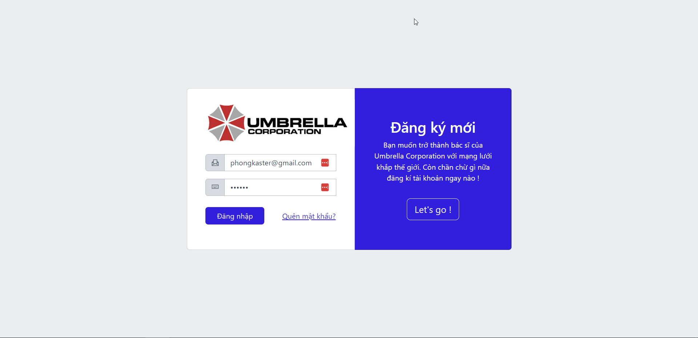

<h3 align="center">

***Chức năng đơn giản nhưng quan trọng với mọi website***
</h3>

Đăng nhập là chức năng mà mọi lập trình viên đều phải biết làm dù là phục vụ cho website hoặc ứng dụng 
di động. Có lẽ không phải nói nhiều nữa🥱. Mình sẽ tiếp tục.

## [**2. Sign Up**](#2-sign-up)

Có đăng nhập thì dĩ nhiên là phải có đăng ký rồi. Tính năng này thì chẳng có gì lạ lẫm với các bạn cả. Ngoài các thông tin người dùng nhập vào và sau khi kiểm tra hợp lệ
thì họ sẽ được nhận một email thông báo gửi tới email mà được sử dụng để tài khoản như sau:

    

<h3 align="center">

**Chúc mừng bạn đã trở thành thành viên của tập đoàn Umbrella Corporation 🎇**
</h3>

## [**3. Recovery Password**](#3-recovery-password)

Bạn bị bệnh não cá vàng 🐠🐠? Bạn hay làm trước quên sau ? Lần này thì quên cmn luôn mật khẩu mình vừa mới tạo. 
Đừng lo ! Website này hỗ trợ luôn trường hợp bạn quên mật khẩu. Chỉ cần nhập đúng email bạn đã đăng kí tài khoản tại **UMBRELLA CORPORATION** 

Giao diện sẽ yêu cầu chúng ta nhập một số thông tin cơ bản như sau:

    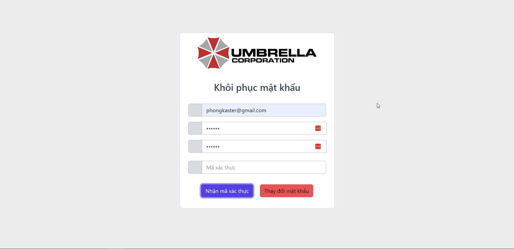

<h3 align="center">

**Nhấn nút nhận mã xác thực để lấy mã với email mà bạn đã nhập ở bên trên😎😍**
</h3>

Sau khi hệ thống làm việc thì sẽ gửi về thông báo như hình:

    

<h3 align="center">

**Kiểm tra Gmail thôi nào 🤗🤩**
</h3>

BÙM 🔥🔥🔥 Ngạc nhiên chưa !! Nhập cái mã bên dưới và tạo lại mật khẩu nào 

    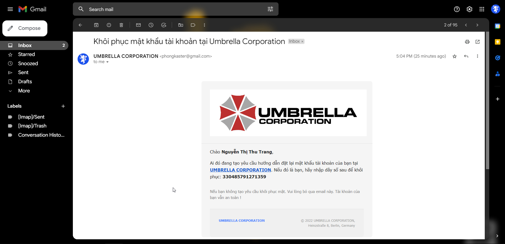

<h3 align="center">

**Lần sau đừng quên mật khẩu nữa nha 😅😅**
</h3>

## [**4. Dashboard**](#4-dashboard)

Màn hình này được sử dụng để liệt kê các thông tin cơ bản của website như hình minh họa dưới đây:

    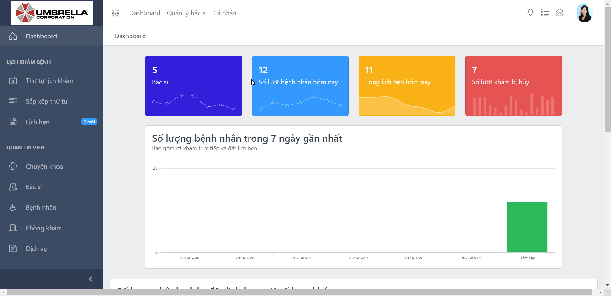

<h3 align="center">

**Dashboard cho phép các bác sĩ xem được những thông tin cơ bản về bệnh nhân**
</h3>

Chúng ta có thể xem được những thông tin như:

- Số lượng bác sĩ đang làm việc 

- Số lượng bệnh nhân khám ngày hôm nay 

- Số lượng bệnh nhân đặt lịch khám qua ứng dụng từ trước( vẫn cho đặt trước thời gian khám nhưng chỉ nhận 
số thự khám khi đến bệnh viện)

- Số lượt khám bị hủy

- Số lượng bệnh nhân trong 7 ngày 

- .....

Đại khái là phần này là những thông tin thuộc dạng vô thưởng vô phạt. Về bản chất, đề tài của Phong là 
hỗ trợ bệnh nhân đặt lượt khám và bác sĩ thì nắm được thứ tự bệnh nhân mà mình sẽ khám. Nghĩa là đề tài 
không hề có yếu tố `quản lý` trong đề tài. 

Vậy nên dashboard là chức năng không bắt buộc phải làm trong 
đề tài này🙋‍♂️🙋‍♂️

## [**5. Thứ tự lượt khám**](#5-thứ-tự-lượt-khám)

Chức năng này là chức năng cho phép `bác sĩ` hoặc `hỗ trợ viên` xem và chỉnh sửa thứ tự khám bệnh
của các bệnh nhân.

Đây là chức năng tốn khá nhiều thời gian của Phong khi làm nhưng không khó nha😋😋 Chỉ là 
code nhiều thôi chứ tư duy thì không nhiều lắm. Tuy chỉ có một màn hình nhưng 
màn hình này cung cấp đủ các chức năng cơ bản: thêm - sửa - xóa 

Ngoài ra thì tốn thời gian nhất với mình là phần phân trang (paging) do mình code JavaScript thuần từ 
đầu tới cuối nên đây là chức năng tốn thời gian khá lâu.

Còn những chức năng khác thì jQuery vẫn là chân ái😎😎

    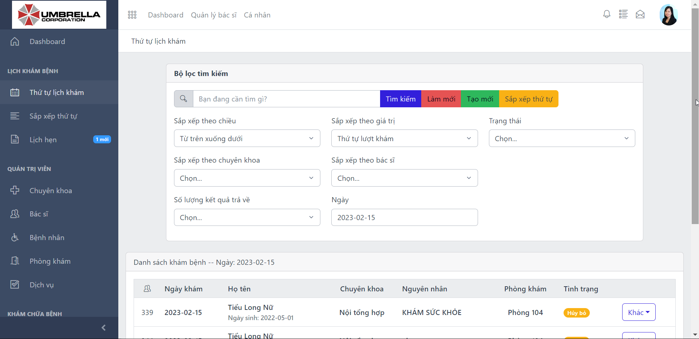

<h3 align="center">

**Thêm - xóa - sửa lượt khám của các bệnh nhân 👨‍⚕️👩‍⚕️**
</h3>

Các bác sĩ thì có thể bắt đầu khám bệnh bằng cách viết `bệnh án` và `phác đồ điều trị, đơn thuốc`. Khi khám 
xong cho bệnh nhân thì ấn nút **Xong**. Còn nếu bệnh nhân vắng mặt thì chọn **Hủy** hoặc **Xóa**.

    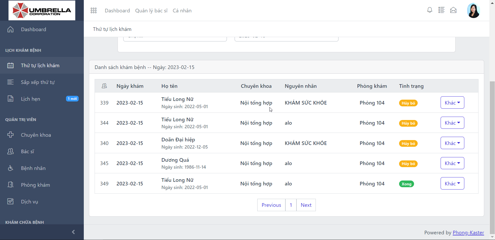

<h3 align="center">

**Trạng thái tương ứng khi một lượt bệnh nhân được khám xong 👨‍⚕️👩‍⚕️**
</h3>

## [**6. Sắp xếp lượt khám**](#6-sắp-xếp-lượt-khám)

Chức năng này thay đổi thứ tự khám của bệnh nhân. Để thay đổi thì ta chỉ cần giữ chuột vào ở 
tên bệnh nhân mong muốn & kéo thả đến vị trí mới. 

> Lưu ý: Hai bệnh nhân ở đầu hàng chờ thì sẽ không thể đổi thứ tự khám nữa & được tô màu xanh lá 💚 
để nhận biết

    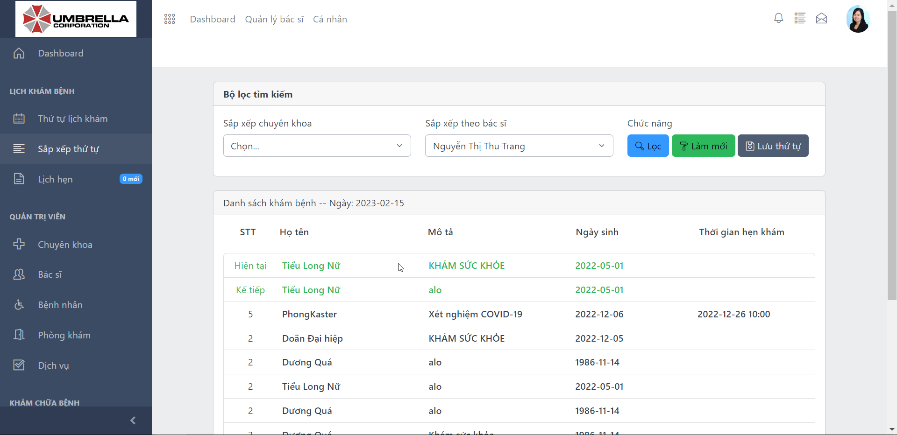

<h3 align="center">

**Kéo & thả để thay đổi thứ tự khám của bệnh nhân🥶🥵😨**
</h3>

## [**7. Tạo thứ tự lượt khám & Cơ chế**](#7-cơ-chế-tạo-thứ-tự-lượt-khám)

Như tiêu đề thì khi đến chúng ta đến bệnh viện thì nếu muốn khám bệnh thì `hỗ trợ viên` sẽ 
phải tạo lượt khám cho bệnh nhân mới. Điều này có thể dẫn tới 2 trường hợp:

- **Trường hợp 1**: Bệnh nhân mô tả bệnh lý của mình & chỉ muốn được khám bệnh. Họ không quan 
tâm tới bác sĩ nào sẽ khám cho mình. 

- **Trường hợp 2**: Bệnh nhân mô tả bệnh lý & có mong muốn chỉ định bác sĩ sẽ khám cho mình. 

Đối với **Trường hợp 1** thì thao tác sẽ đơn giản hơn. `Hỗ trợ viên` chỉ cần chọn mô tả bệnh lý phù 
hợp và bệnh nhân sẽ được hệ thống tự động chỉ định tới một trong các bác sĩ có chuyên khoa 
tương ứng.

    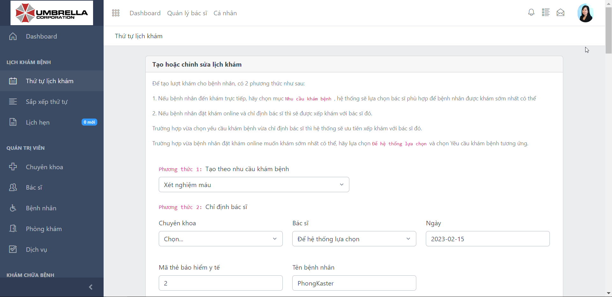

<h3 align="center">

**Hệ thống tự động chỉ định bác sĩ nếu bệnh nhân không có nhu cầu🥶🥵😨**
</h3>

Cơ chế phân công bác sĩ có thể phát biểu như sau: 

- **Bước 1**: Hệ thống tìm tất cả các `bác sĩ` có cùng chuyên khoa dựa trên `nhu cầu khám bệnh`.

- **Bước 2**: Hệ thống tính toán số lượng bệnh nhân đang chờ được khám của từng bác sĩ hiện tại.

- **Bước 3**: Hệ thống so sánh & chọn ra bác sĩ có số lượng bệnh nhân đang chờ khám là thấp nhất 

& chỉ định khám cho bệnh nhân này

> Trường hợp các bác sĩ có số lượng bệnh nhân bằng nhau thì sắp xếp theo ID của bác sĩ & lấy ra người đầu tiên để khám cho bệnh nhân mới 

> Hỏi: Vậy sẽ thế nào nếu như không phải mọi bác sĩ đều có mặt vào ngày hôm nay?
>
> Đáp: Đề tài của Phong thì Phong không chuyên làm website để làm tới chức năng này😊😊 & giáo viên hướng dẫn cũng không 
yêu cầu & cuối cùng là thời gian 3 tháng là không đủ để làm website nhiều chức năng tới vậy. Tuy nhiên, nếu muốn giải bài toán này thì chúng ta sẽ làm thêm chức năng để biết ai đang online và ai đang offline
> (kiểu giống như Facebook ấy). Tiếp đó, ta lấy những bác sĩ đang online(tức đang đi làm) để tính toán và phân công bệnh nhân

Nếu chia vào trường hợp này thì các bệnh nhân sẽ được chia đều về các bác sĩ như mô tả kể trên:

    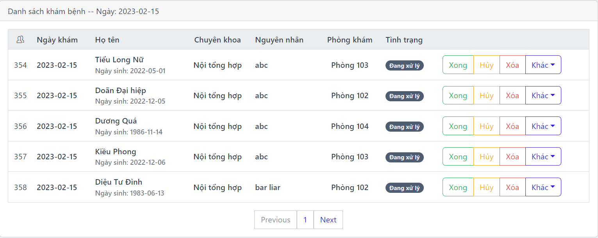

    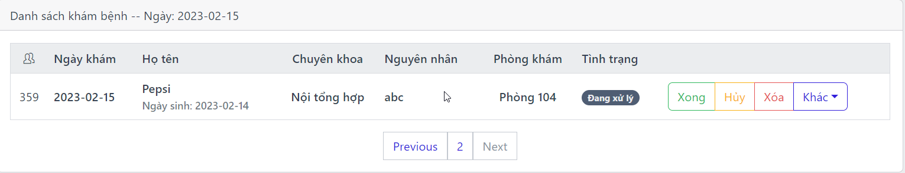

<h3 align="center">

**Cùng nguyên nhân khám thì sẽ được chia đều tới các phòng khám**
</h3>

Đối với **Trường hợp 2** thì chúng ta sẽ nhắc cho bệnh nhân một thông báo như sau:

    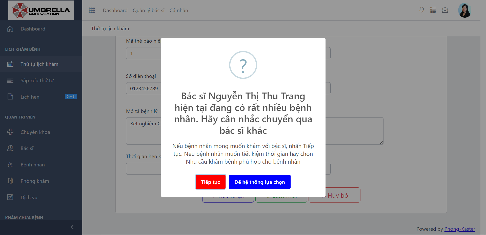

<h3 align="center">

**Bạn có sẵn sàng chờ để được đúng bác sĩ mong muốn khám cho mình?**
</h3>

Nếu **Tiếp tục** thì bệnh nhân vẫn được đáp ứng như ý muốn(Nhưng mà có thể phải chờ dài cả cổ ra 😭😭)

Nếu **Để hệ thống lựa chọn** thì quay lại **Trường hợp 1**.

## [**8. Lịch hẹn**](#8-lịch-hẹn)

Như mình đã giới thiệu ở trên nhưng nếu quên thì mình xin nhắc lại là `chức năng này không tạo lịch 
hẹn để ai bỏ tiền để đến giờ nào khám thì khám mà tuân theo nguyên tắc ai đến trước thì khám trước`. 
Vì đây là yêu cầu từ thầy Hào - giáo viên hướng dẫn của mình nên chắc chắn là phải tuân theo roy 😋😋.

Việc tạo lịch hẹn ở đây để nhằm mục đích tiết kiệm thời gian đăng kí lúc đến khám bệnh. Chúng ta vẫn 
có thể đưa ra giờ mong muốn nhưng tùy thuộc vào số lượng bệnh nhân hiện tại thì `hỗ trợ viên` có thể thay đổi 
thứ tự khám cho chúng ta hoặc không. 

    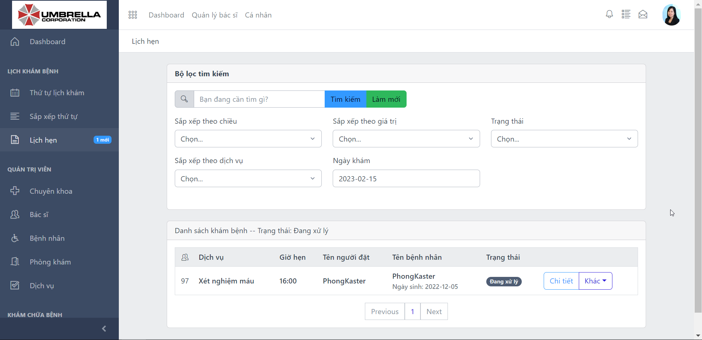

<h3 align="center">

**Lịch hẹn là một chức năng chỉ giúp ta tiết kiệm thời gian đăng kí khám bệnh⌚⌛**
</h3>

## [**9. Các chức năng Quản lý khác**](#9-các-chức-năng-quản-lý-khác)

Phần này thì Phong chỉ giới thiệu sơ ra về các chức năng Quản lý. Vì các chức năng này khá là căn bản, chỉ 
đơn thuần là `thêm - sửa - xóa`. Các chức năng này không quá nổi bật nhưng phải có trong đồ án để website đặt tới sự hoàn hảo & nhất quán nhất.

    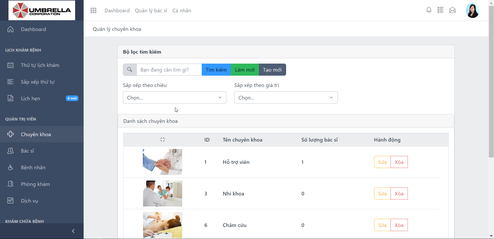

<h3 align="center">

**Chuyên khoa - nơi ta quản lý thông tin chuyên khoa mà các bác sĩ đang làm việc👰**
</h3>

    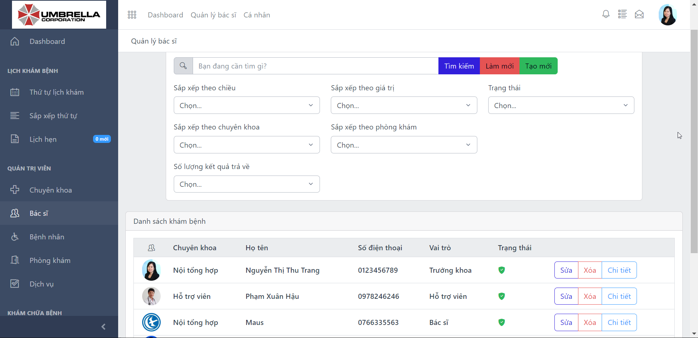

<h3 align="center">

**Bác sĩ - nơi ta quản lý thông tin cá nhân của các bác sĩ đang làm việc👨‍⚕️👩‍⚕️**
</h3>

    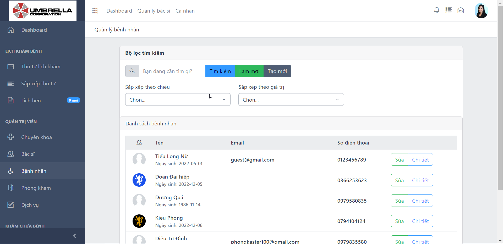

<h3 align="center">

**Bệnh nhân - nơi ta quản lý thông tin cá nhân của bệnh nhân🤕😷**
</h3>

Đầy đủ các chức năng nhập xuất thông tin cơ bản nha. Bác sĩ và bệnh nhân thì đều là con người nên 
thông tin cũng gần tương tự nhau

    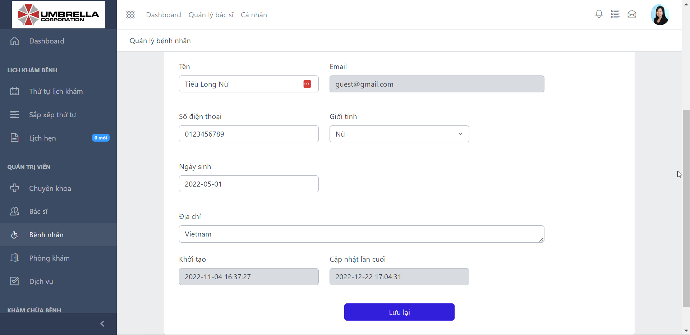

<h3 align="center">

**Thông tin cá nhân của bác sĩ & bệnh nhân thì tương tự nhau🙋‍♂️🙋‍♀️**
</h3>

Tiếp theo, chúng ta có thông tin phòng khám - nơi các bác sĩ làm việc. Điều này, giúp bệnh nhân có 
thể dễ dàng đúng phòng bệnh mong muốn.

    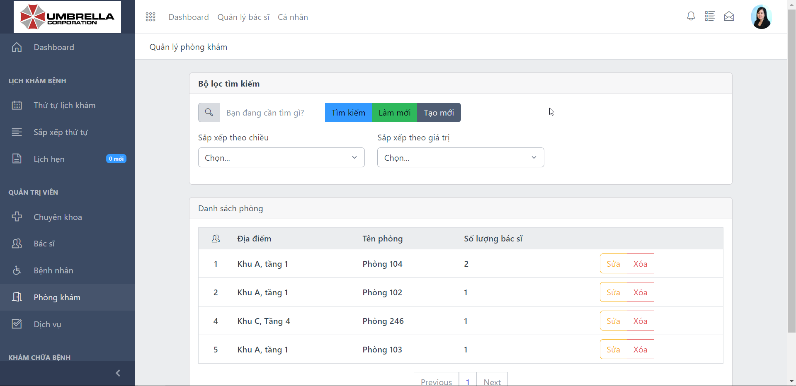

<h3 align="center">

**Bác sĩ cần tìm đang làm việc tại phòng nào?🏢🏦**
</h3>

Cuối cùng, chúng ta có dịch vụ. Thực chất là phần nguyên nhân khám bệnh
 ở phần [**Tạo thứ tự lượt khám**](#7-cơ-chế-tạo-thứ-tự-lượt-khám)

 

    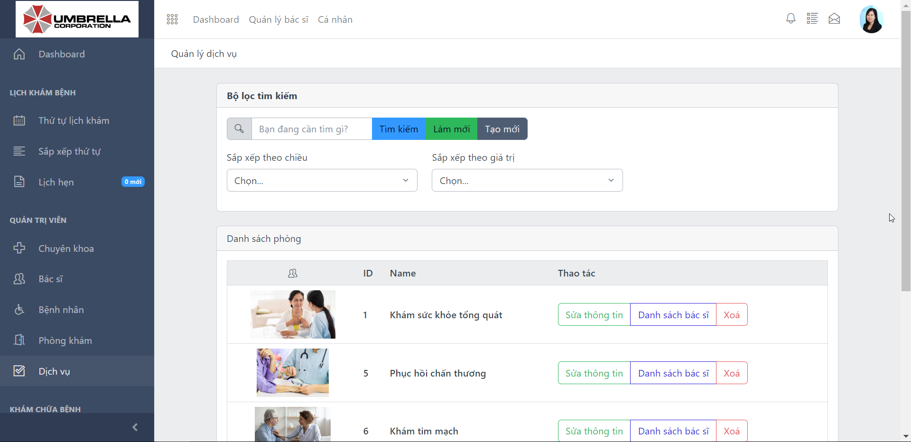

<h3 align="center">

**Mục này quản lý những nguyên nhân khám bệnh phổ biến**
</h3>

## [**10. Thông tin cá nhân**](#10-thông-tin-cá-nhân)

Phần này thể hiện thông tin cá nhân của bạn - người đang trực tiếp sử dụng phần mềm này. 

    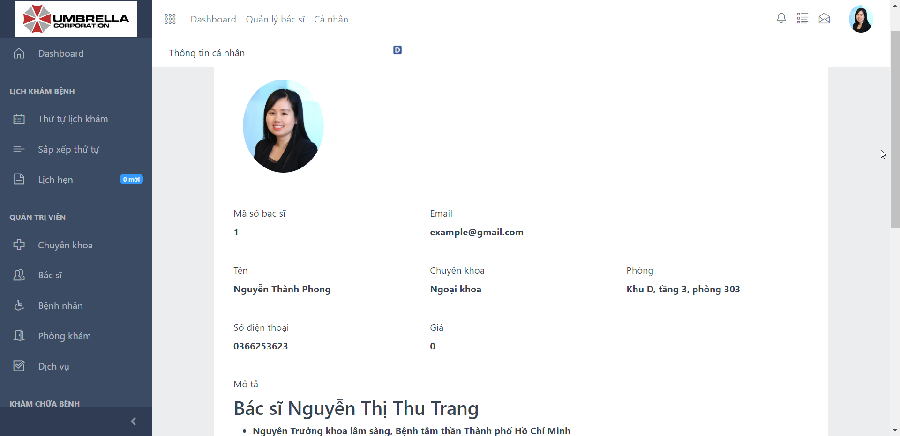

    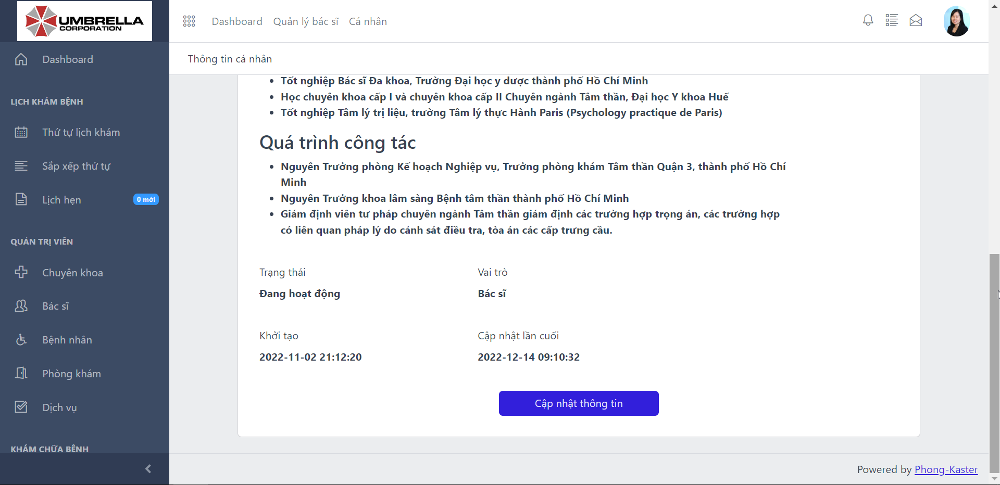

<h3 align="center">

**Thông tin cá nhân👩‍💻👩‍💻👨‍💻👨‍💻**
</h3>

Chúng ta có thể xem và thay đổi thông tin cá nhân & hình đại diện nếu muốn. Tuy nhiên, trong thực tế, 
Phong cho rằng bác sĩ không thể tự ý đổi thông tin cá nhân được đâu mà sẽ do một quản trị viên(admin) 
thay đổi các thông tin cá nhân.

## [**11. Thay đổi mật khẩu**](#11-thay-đổi-mật-khẩu)

    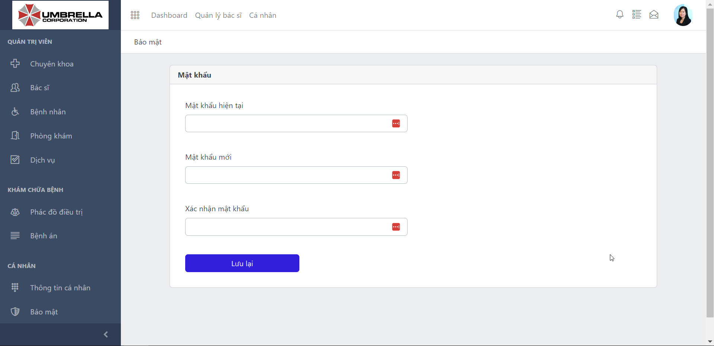

<h3 align="center">

**Thay đổi mật khẩu bất cứ lúc nào🤹‍♂️🤹‍♀️**
</h3>

# [**Post Script**](#)

- **03-03-2023**: Chà đã 1 tháng trôi qua rồi mà vẫn chưa tìm được việc làm. Thực sự thấy buồn quá 🤔.
Uả ? Sao trò đời khó đoán quá. Tui có kiến thức, kinh nghiệm thực tế & thái độ nghiêm túc làm việc mà. 
Sao không ai cho tui cơ hội để tỏa sáng nhỉ? Mong sớm tìm được một điểm tựa để tui có thể "bẩy" cả trái đất lên🌎🌍🌏

# [Made with 💘 and PHP ](#made-with-love-and-php)